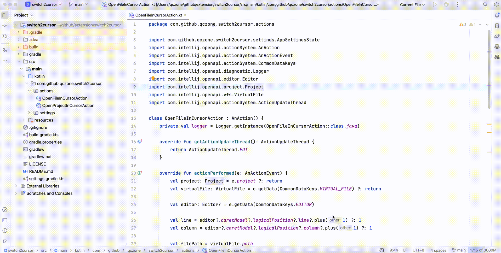

# Switch2AndroidStudio&Xcode

A VSCode extension that enables quick switching between VSCode and Android Studio or Xcode. Note that WebStorm support has been removed from version 1.1.0.

## ✨ Features

- 🚀 Quick switching between VSCode and Android Studio or Xcode
- 📂 Open current file in Android Studio or Xcode with the same position
- 📁 Open current project in Android Studio or Xcode
- 🛠️ Support for:
  - Android Studio
  - Xcode
- ⌨️ Keyboard shortcuts support
- 📝 Context menu integration
- 🌐 Cross-platform support (Windows, macOS, Linux)

## 📦 Installation

1. Open VSCode
2. Press `Ctrl+Shift+X` (Windows/Linux) or `Cmd+Shift+X` (macOS) to open the Extensions view
3. Search for "Switch2AndroidStudio"
4. Click Install

Alternatively, you can install from the [Visual Studio Marketplace](https://marketplace.visualstudio.com/items?itemName=baoxin.switch2idea)

## ⚙️ Configuration

Before using the extension, you need to configure the paths to your Android Studio and Xcode:

1. Open VSCode Settings (`Ctrl+,` or `Cmd+,`)
2. Search for "Switch2AndroidStudio"
3. Configure the following paths:
   - `switch2idea.androidStudioPath`: Path to Android Studio executable
   - `switch2idea.xcodePath`: Path to Xcode executable

### Default Paths

- **Android Studio**:
  - Windows: `C:\Program Files\Android\Android Studio\bin\studio64.exe`
  - macOS: `/Applications/Android Studio.app/Contents/MacOS/studio`
  - Linux: `/usr/local/android-studio/bin/studio.sh`

- **Xcode**:
  - macOS: `/Applications/Xcode.app/Contents/MacOS/Xcode`

## 🚀 Usage

### Opening Files

1. Open the file you want to switch in VSCode
2. Use one of the following methods to open the file in Android Studio or Xcode:
   - Keyboard shortcuts:
     - Android Studio: `Alt+Shift+O a`
     - Xcode: `Alt+Shift+O x`
   - Right-click the file and select "Open File in [IDE]"
   - Use the Command Palette (`Ctrl+Shift+P`) and type "Open File in [IDE]"

### Opening Projects

1. Open the project you want to switch in VSCode
2. Use one of the following methods to open the project in Android Studio or Xcode:
   - Keyboard shortcuts:
     - Android Studio: `Alt+Shift+P a`
     - Xcode: `Alt+Shift+P x`
   - Right-click the project in the Explorer and select "Open Project in [IDE]"
   - Use the Command Palette (`Ctrl+Shift+P`) and type "Open Project in [IDE]"

## ⌨️ Keyboard Shortcuts

- **Android Studio**:
  - Open File: `Alt+Shift+O a`
  - Open Project: `Alt+Shift+P a`
- **Xcode**:
  - Open File: `Alt+Shift+O x`
  - Open Project: `Alt+Shift+P x`

## 🤝 Contributing

We welcome contributions! Here's how you can help:

1. Fork the repository
2. Create a feature branch (`git checkout -b feature/amazing-feature`)
3. Commit your changes (`git commit -m 'Add some amazing feature'`)
4. Push to the branch (`git push origin feature/amazing-feature`)
5. Open a Pull Request

## ❓ FAQ

### Q: The IDE doesn't open when I use the shortcut or context menu
A: Please check:
1. The IDE path is correctly configured in VSCode settings
2. The IDE is properly installed
3. You have sufficient permissions to run the IDE

### Q: Can I use different IDEs for different projects?
A: Yes! You can configure IDE paths per workspace:
1. Open VSCode settings
2. Switch to the Workspace tab
3. Configure the IDE paths for your current workspace

### Q: Does it support WebStorm or other JetBrains IDEs?
A: Starting from version 1.1.0, the extension no longer supports WebStorm. It now only supports Android Studio and Xcode. Support for other IDEs may be added in future versions.

## 📄 License

This project is licensed under the MIT License - see the [LICENSE](LICENSE) file for details.

## 📮 Feedback

If you encounter any issues or have suggestions, please:
- [Open an Issue](https://github.com/baoxin/switch2idea/issues)
- [Submit a Pull Request](https://github.com/baoxin/switch2idea/pulls)

[中文文档](README_zh.md)