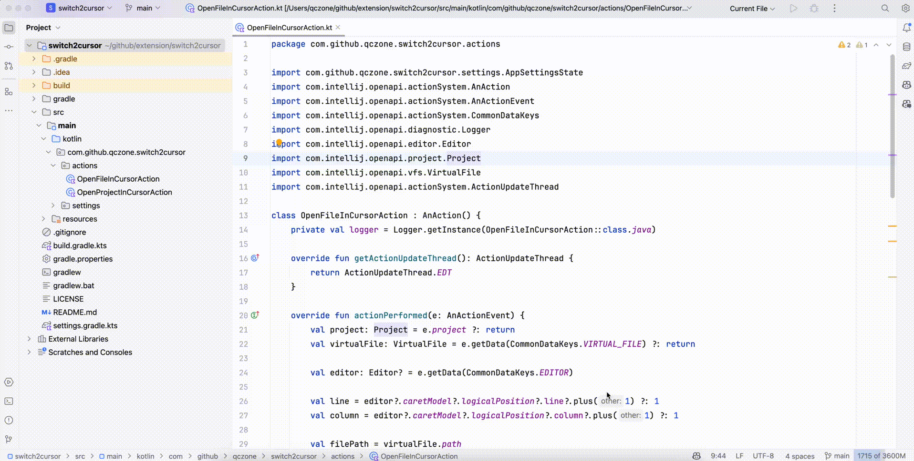

# Switch2Idea

一个快速在 VSCode 和 JetBrains IDE（IntelliJ IDEA、WebStorm、Android Studio）之间切换的 VSCode 插件。

## ✨ 功能特点

- 🚀 快速在 VSCode 和 JetBrains IDE 之间切换
- 📂 支持打开当前文件到 JetBrains IDE 的相同位置
- 📁 支持打开当前项目到 JetBrains IDE
- 🛠️ 支持多个 JetBrains IDE：
  - IntelliJ IDEA
  - WebStorm
  - Android Studio
- ⌨️ 支持快捷键操作
- 📝 支持右键菜单操作
- 🌐 支持跨平台（Windows、macOS、Linux）

## 📦 安装

1. 打开 VSCode
2. 按下 `Ctrl+Shift+X`（Windows/Linux）或 `Cmd+Shift+X`（macOS）打开扩展视图
3. 搜索 "Switch2Idea"
4. 点击安装

或者从 [Visual Studio Marketplace](https://marketplace.visualstudio.com/items?itemName=baoxin.switch2idea) 安装

## ⚙️ 配置

使用扩展之前，需要配置 JetBrains IDE 的路径：

1. 打开 VSCode 设置（`Ctrl+,` 或 `Cmd+,`）
2. 搜索 "Switch2Idea"
3. 配置以下路径：
   - `switch2idea.webStormPath`：WebStorm 可执行文件路径
   - `switch2idea.androidStudioPath`：Android Studio 可执行文件路径

### 默认路径

- **WebStorm**：
  - Windows：`C:\Program Files\JetBrains\WebStorm\bin\webstorm64.exe`
  - macOS：`/Applications/WebStorm.app/Contents/MacOS/webstorm`
  - Linux：`/usr/local/bin/webstorm`

- **Android Studio**：
  - Windows：`C:\Program Files\Android\Android Studio\bin\studio64.exe`
  - macOS：`/Applications/Android Studio.app/Contents/MacOS/studio`
  - Linux：`/usr/local/android-studio/bin/studio.sh`

## 🚀 使用方法

### 打开文件

1. 在 VSCode 中打开要切换的文件
2. 使用以下方式之一打开文件到 JetBrains IDE：
   - 快捷键：
     - WebStorm：`Alt+Shift+O`
     - Android Studio：`Alt+Shift+O Alt+Shift+O`
     - Xcode：`Alt+Shift+O Alt+Shift+X`
   - 右键点击文件，选择"在 [IDE] 中打开文件"
   - 使用命令面板（`Ctrl+Shift+P`），输入"在 [IDE] 中打开文件"

### 打开项目

1. 在 VSCode 中打开要切换的项目
2. 使用以下方式之一打开项目到 JetBrains IDE：
   - 快捷键：
     - WebStorm：`Alt+Shift+P`
     - Android Studio：`Alt+Shift+P Alt+Shift+P`
     - Xcode：`Alt+Shift+P Alt+Shift+X`
   - 在资源管理器中右键点击项目，选择"在 [IDE] 中打开项目"
   - 使用命令面板（`Ctrl+Shift+P`），输入"在 [IDE] 中打开项目"

## ⌨️ 快捷键

- **WebStorm**：
  - 打开文件：`Alt+Shift+O`
  - 打开项目：`Alt+Shift+P`
- **Android Studio**：
  - 打开文件：`Alt+Shift+O Alt+Shift+O`
  - 打开项目：`Alt+Shift+P Alt+Shift+P`
- **Xcode**：
  - 打开文件：`Alt+Shift+O Alt+Shift+X`
  - 打开项目：`Alt+Shift+P Alt+Shift+X`

## 🤝 贡献

欢迎贡献！以下是参与方式：

1. Fork 本仓库
2. 创建特性分支（`git checkout -b feature/amazing-feature`）
3. 提交更改（`git commit -m '添加新特性'`）
4. 推送到分支（`git push origin feature/amazing-feature`）
5. 提交 Pull Request

## ❓ 常见问题

### Q: 使用快捷键或右键菜单后 IDE 没有打开
A: 请检查：
1. VSCode 设置中的 IDE 路径是否正确配置
2. IDE 是否正确安装
3. 是否有足够的权限运行 IDE

### Q: 可以为不同项目使用不同的 IDE 吗？
A: 可以！你可以为每个工作区配置不同的 IDE 路径：
1. 打开 VSCode 设置
2. 切换到工作区标签页
3. 为当前工作区配置 IDE 路径

### Q: 支持其他 JetBrains IDE 吗？
A: 目前扩展官方支持 IntelliJ IDEA、WebStorm 和 Android Studio。其他 JetBrains IDE 的支持可能会在未来的版本中添加。

## 📄 许可证

本项目采用 MIT 许可证 - 详见 [LICENSE](LICENSE) 文件

## 📮 反馈

如果遇到问题或有建议，请：
- [提交 Issue](https://github.com/baoxin/switch2idea/issues)
- [提交 Pull Request](https://github.com/baoxin/switch2idea/pulls)

[English Documentation](readme.md)